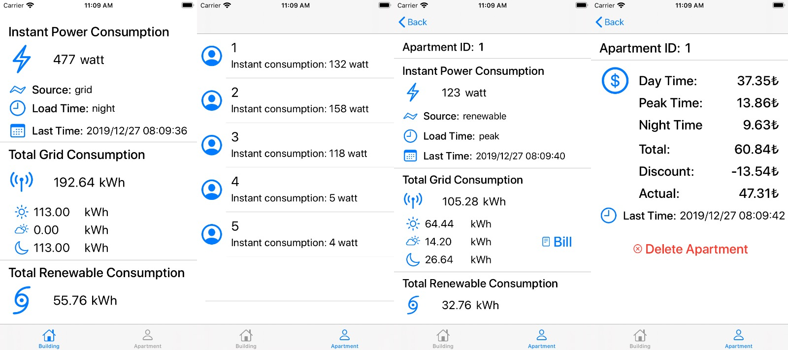

# Smart Electrical Grid for Buildings

Just a concept system. Nothing fancy in backend or client, no authentication, no ORM just plain old SQL in backend and a sketchy iOS app. Arduino node code is actually written by others so there are some Turkish words in [code](./node/cdtp-arduino.ino) for their needs, this is code for a dummy node just creates random values and posts them to the endpoint.

Demo API URL: [https://cdtp-server.herokuapp.com/](https://cdtp-server.herokuapp.com/)

#### API Endpoints

- [ ] // TODO

##### iOS app screenshots:

### Running

- Deploy [backend](./backend) to [Heroku](https://devcenter.heroku.com/articles/getting-started-with-python#deploy-the-app).
- Upload [cdtp-arduino.ino](./node/cdtp-arduino.ino) to NodeMCU or any other ESP8266 controller.
- Open [cdtp-client.xcodeproj](./client/cdtp-client.xcodeproj) in XCode, build and upload the app to your iPhone.
